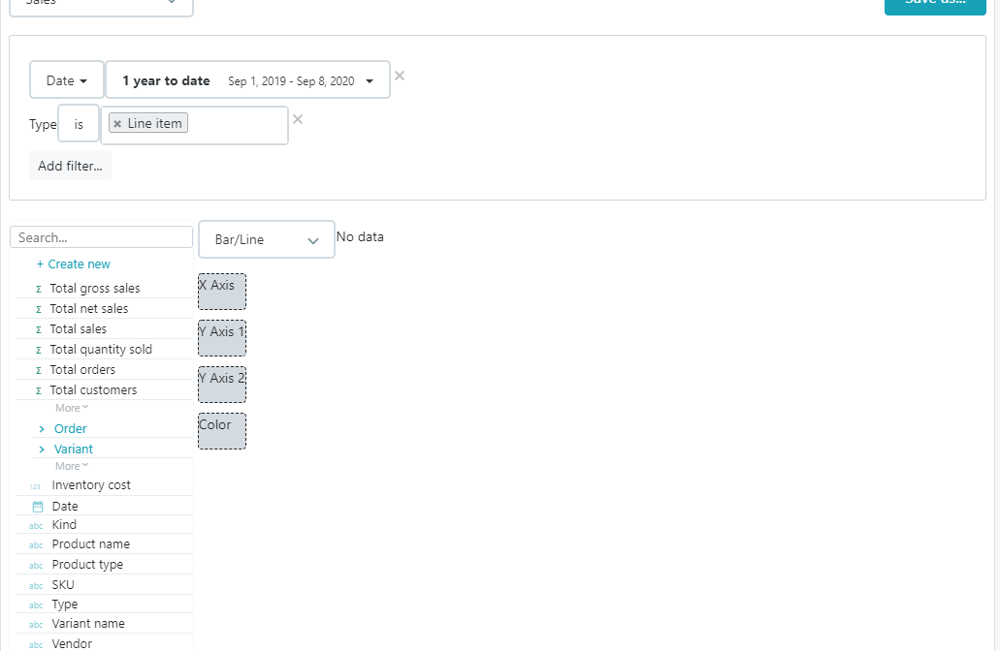

# Configuring a bar / line report

Use bar charts and line charts to visualize your data.

* Assign a dimension to the X Axis, typically either a date field or a text field.
* Assign one or several measures to the Y Axis 1 and 2.
* Assign a color dimension to create a separate series for each value \(optional\)

