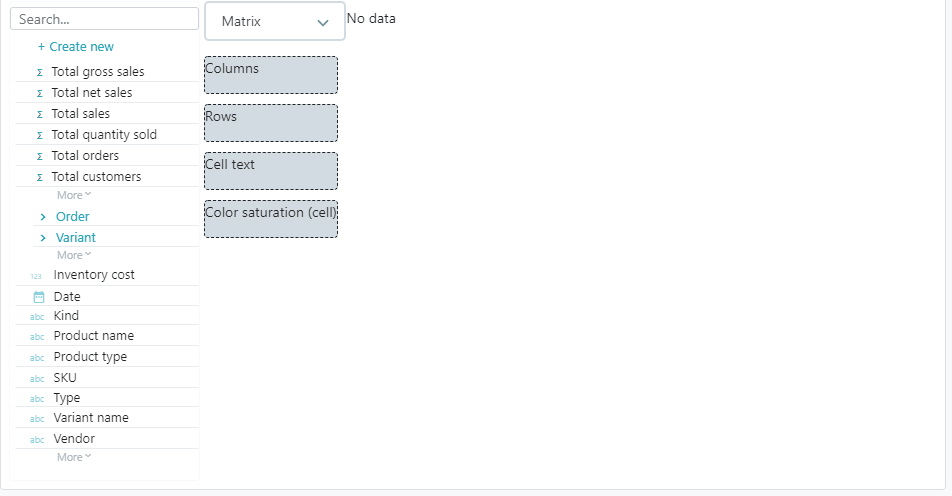

# Configuring a matrix report

Use matrix reports \(also known as pivot tables or cross tabs\) to show your data in a tabular format, with dimensions across both rows and columns, and data cells showing a measure.

* Assign one or more dimensions to columns
* Assign one or more dimensions to rows
* Assign a measure to the cell text
* Assign a measure for the cell color \(optional\)
  *  A linear interpolation is applied from the lowest value \(white\) to the highest value \(dark green\)


We are **working on** new matrix features to control **sorting** and **subtotals**.


​  

