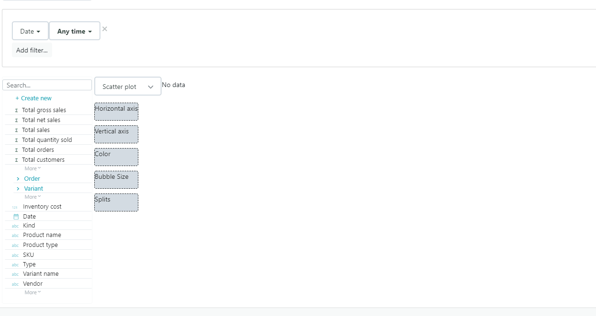

# Configuring a scatter plot report

Use scatter plots to visualize the correlation between two numeric variables.

* Assign a measure to the horizontal axis
* Assign a measure to the vertical axis
* Assign a color dimension to create a colored bubble for each dimension value \(optional\)
* Assign a measure to size the bubbles \(optional\)
* Assign one or several split dimensions to further splits into additional bubbles

  

​  

