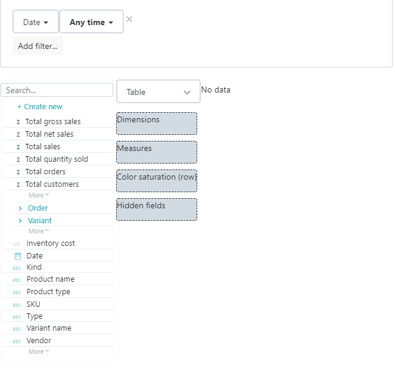

# Configuring a table report

Use table reports to show data in a tabular format, with **dimension columns \(1\)** on the **left side** of the table and **measure columns** \(2\) on the **right side** of the table.

You can also assign a measure that determines the Color saturation of the row \(3\).  
A linear interpolation is applied from the lowest value \(white\) to the highest value \(dark green\).

#### ​

#### Sorting, subtotals and grand totals

You can sort table reports by one or multiple fields \(1\), and show a subtotal for each level.  
For each sorted field, you can choose whether to display a subtotal \(2\).  
Date fields can display a subtotal at several levels, such as month, quarter and/or year.  
A checkbox is also available to display a grand total at the very bottom of the table \(3\).

  

