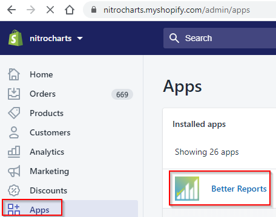

# Store accounts

If you installed **Better Reports** on your store directly from the [Shopify app store](https://apps.shopify.com/betterreports), a special account is created automatically for your store. You don't have to create an organization or a personal account. All staff members of your store can open the Better Reports app directly from the Shopify admin.

That being said, Shopify store accounts have some limitations:

* Cannot add additional data connections. You can only use the data from your Shopify store (other connectors are not available).
* You cannot invite external users. Your store's staff members (defined in your Shopify store settings) are the only people that can log in. They do so by opening the Better Reports app directly from Shopify admin.

### Should I use a personal account or store account?

It depends. :thinking: Some store owners like using a store account because of the simplicity of having Better Reports integrated directly in their Shopify admin. It removes the need to manage users in two different places.&#x20;

We recommend creating personal accounts if:

* You need to invite external users (who don't have access to your Shopify store)
* You need to pull data from additional connectors (not just your Shopify data)
* You want to restrict report access to only invited members (we can manually disable Better Reports access via Shopify)

### Billing and schedule quota

No credit card is required when using a store account. Billing occurs directly on your Shopify invoice.\
Instead of charging for [schedule overage](../the-basics/scheduling-reports/overage-pricing.md), you are entitled to a free quota of monthly schedules.

### 

### How much Quota do I get?

Quota depends on your Shopify Plan and is currently tiered as follows:

| Plan             | Monthly Runs Quota | Monthly Emails Quota |
| ---------------- | ------------------ | -------------------- |
| Basic Shopify    | 1000               | 250                  |
| Shopify          | 1000               | 500                  |
| Advanced Shopify | 1000               | 1000                 |
| Shopify Plus     | 3000               | 3000                 |

Please reach out to us at [hello@betterreports.com](mailto:mailto:hello@betterreports.com) if you need to purchase additional quota.

